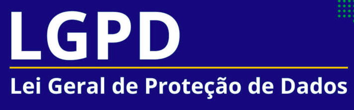

  

  Guia básico sobre a LGPD (Lei Geral de Proteção de Dados).   Lei 13.709/2018 que entrou em vigor no Brasil dia 18/09/2020.

### Introdução

1. [O que é LGPD?](/introducao/o-que-e-lgpd.md)
2. [Por que a LGPD é tão importante?](/introducao/por-que-a-lgpd-e-tao-importante.md)
3. [O que é ANPD?](/introducao/o-que-e-anpd.md)
4. [O que a lei considera como tratamento de dados?](/introducao/o-que-a-lei-considera-como-tratamento-de-dados.md)

### Dados pessoais

1. [O que são dados pessoais?](/dados-pessoais/o-que-sao-dados-pessoais.md)
2. [Todos os dados são considerados pessoais?](/dados-pessoais/todos-os-dados-sao-considerados-pessoais.md)
3. [Como funciona o tratamento de dados?](/dados-pessoais/como-funciona-o-tratamento-de-dados.md)
4. [O que são dados pessoais sensíveis?](/dados-pessoais/o-que-sao-dados-pessoais-sensiveis.md)

### Dados anonimizados

1. [O que são dados anonimizados?](/dados-anonimizados/o-que-sao-dados-anonimizados.md)

### Dados públicos

1. [O que são dados públicos?](/dados-publicos/o-que-sao-dados-publicos.md)

### Controlador, operador e encarregado

1. [O que são controlador?](/controlador-operador-encarregado/o-que-sao-controlador.md)
2. [O que são operador?](/controlador-operador-encarregado/o-que-sao-operador.md)
3. [O que são encarregado?](/controlador-operador-encarregado/o-que-sao-encarregado.md)
4. [Diferença de operador e controlador.](/controlador-operador-encarregado/diferenca.md)

### Os 10 princípios da LGPD

0. [Introdução.](/os-10-principios-da-lgpd/introducao.md)
1. [Finalidade.](/os-10-principios-da-lgpd/finalidade.md)
2. [Adequação.](/os-10-principios-da-lgpd/adequacao.md)
3. [Necessidade.](/os-10-principios-da-lgpd/necessidade.md)
4. [Livre acesso.](/os-10-principios-da-lgpd/livre-acesso.md)
5. [Qualidade dos dados.](/os-10-principios-da-lgpd/qualidade-dos-dados.md)
6. [Transparência.](/os-10-principios-da-lgpd/transparencia.md)
7. [Segurança.](/os-10-principios-da-lgpd/seguranca.md)
8. [Prevenção](/os-10-principios-da-lgpd/prevencao.md)
9. [Não discriminação.](/os-10-principios-da-lgpd/nao-discriminacao.md)
10. [Responsabilidade e prestação de contas.](/os-10-principios-da-lgpd/responsabilidade-e-prestacao-de-contas.md)

### Direitos dos titulares de dados

1. [Confirmar.](/direitos-dos-titulares-de-dados/confirmar.md)
2. [Acessar.](/direitos-dos-titulares-de-dados/acessar.md)
3. [Corrigir.](/direitos-dos-titulares-de-dados/corrigir.md)
3. [Restrição.](/direitos-dos-titulares-de-dados/restricao.md)
4. [Portabilidade.](/direitos-dos-titulares-de-dados/portabilidade.md)
5. [Eliminação.](/direitos-dos-titulares-de-dados/eliminacao.md)
6. [Informação.](/direitos-dos-titulares-de-dados/informacao.md)
7. [Revogação do consentimento.](/direitos-dos-titulares-de-dados/revogacao.md)
8. [Revisão às decisões automatizadas.](/direitos-dos-titulares-de-dados/revisao-as-decisoes-automatizadas.md)

### Fiscalização, sanções e penalidades

1. [Resumo.](/fiscalizacao-sancoes-e-penalidades/resumo.md)
2. [Exemplo de penalidade.](/fiscalizacao-sancoes-e-penalidades/exemplo-de-penalidade.md)
3. [Âmbito de aplicação](/fiscalizacao-sancoes-e-penalidades/ambito-de-aplicacao.md)
4. [Segurança de dados pessoais, governança e boas práticas.](/fiscalizacao-sancoes-e-penalidades/seguranca-de-dados-pessoais-governanca-e-boas-praticas.md)

### LGPD X GDPR

1. [O que é GDPR?](/gdpr/o-que-e-gdpr.md)
2. [Quais as diferenças entre LGPD e GDPR?](/gdpr/diferencas-entre-lgpd-e-gdpr.md)
3. [Quem deve se adequar a GDPR?](/gdpr/quem-deve-se-adequar-na-gdpr.md)

### Como contribuir com o projeto

1. Realize um Fork do projeto.
2. Crie uma branch com a nova feature.
3. Realize o commit.
4. Realize o Push na Branch.
5. Abra um Pull Request.

### Autor

- Niag de Souza Alves - [Twitter](https://twitter.com/niagalves) - [LinkedIn](https://www.linkedin.com/in/niagalves/)

### Referências

- [Quais são os direitos dos titulares de dados?](https://suporte.jusbrasil.com.br/hc/pt-br/articles/360051439171-Quais-s%C3%A3o-os-direitos-dos-titulares-de-dados-)
- [LGPD: esclarecendo os papéis de controlador e operador.](https://www.tecmundo.com.br/seguranca/177606-lgpd-esclarecendo-papeis-controlador-operador.htm)
- [Introdução à Lei Brasileira de Proteção de Dados Pessoais.](https://www.escolavirtual.gov.br/curso/153)
- [LGPD - Parte I - Introdução.](https://dev.to/lfrigodesouza/lgpd-parte-i-introducao-1g2m)
- [Tudo que você precisa saber sobre a LGPD!](https://www.youtube.com/watch?v=hu6XIc7QVnE)
- [Node.js API - LGPD e JSON Web Token: Dicas para trabalhar com dados sensíveis de forma segura](https://www.youtube.com/watch?v=R3ZcbbPmw-c)
- [Jusbrasil.](https://www.jusbrasil.com.br/busca?q=lgpd)
- [Planalto.](http://www.planalto.gov.br/ccivil_03/_ato2015-2018/2018/lei/L13709.htm)
- [Multas sobre a LGPD começam a valer dentro de 8 meses.](https://www.jornalcontabil.com.br/multas-sobre-a-lgpd-comecam-a-valer-dentro-de-8-meses/)
- [10 princípios da LGPD para o tratamento de dados pessoais](https://ndmadvogados.jusbrasil.com.br/artigos/698194397/10-principios-da-lgpd-para-o-tratamento-de-dados-pessoais)
- [O que é GDPR e como você e sua empresa podem ser impactados?](https://conube.com.br/blog/o-que-e-gdpr/)
- [LGPD vs. GDPR](https://www.onetrust.com/br/blog/lgpd-vs-gdpr/)
- [Com a Lei em vigor, quais as diferenças entre a LGPD e GDPR?](https://www.compugraf.com.br/diferencas-entre-lgpd-e-gdpr/)

  

